# PaShare ✨
---

## 🛠️ 서비스 소개
PaShare는 "Paste" + "Share" 를 합쳐 만들어진 이름으로,
**초간단 텍스트 공유 플랫폼**입니다.  
회원가입도, 로그인도 없습니다.  
**패스코드 하나로** 텍스트를 공유하고,  
시간이 지나면 텍스트는 **자동으로 삭제**됩니다.

**언제 사용하면 좋을까요?**
- 급하게 메모를 넘겨야 할 때
- 다른 기기로 텍스트를 옮겨야 할 때
- 친구와 빠르게 코드나 링크를 주고받고 싶을 때

> "카톡 보내기도 귀찮을 때, PaShare 하세요."
---


> 복붙보다 빠른 텍스트 공유. 그냥 패스코드만 주고받으세요.
[👉 바로 사용해보기](https://pashare.purplecodelabs.com)  

---

## ✨ 주요 기능
- **패스코드 기반** 텍스트 공유
- **URL로 바로 접근** 가능
- **시간 제한 후 자동 삭제**
- **심플하고 빠른 UI**

---

## 🚀 빠른 시작
### 1. 텍스트 작성
사이트에 접속해서 텍스트를 입력하고 **패스코드**를 설정합니다.

### 2. 패스코드 공유
생성된 **URL**을 상대방에게 보내세요.

### 3. 끝
상대방은 링크를 클릭하면 바로 텍스트를 확인할 수 있습니다.

> 텍스트는 시간이 지나면 알아서 사라집니다. 따로 삭제할 필요도 없어요.

---

## 🧩 기술 스택
| 분야 | 기술 |
|:---|:---|
| Backend | Java, Spring Boot |
| Frontend | Thymeleaf, JavaScript |
| Database | MariaDB |
| Infra | Nginx, Docker |
| Hosting | 개인 미니PC 서버 |
| 기타 | Cloudflare, Let's Encrypt SSL 인증서 |

---

## 🗂️ 프로젝트 구조
```
com.pashare
├── controller    // 웹 요청 처리
├── domain        // 엔티티 및 DB 모델
├── repository    // 데이터베이스 접근
├── service       // 비즈니스 로직
├── config        // 설정 관련 클래스
└── global        // 공통 기능 (예외처리 등)
```

---

## 🏗️ 설치 및 실행
로컬에서 직접 띄워보고 싶다면:
```bash
git clone https://github.com/Cherryshine/PaShare.git
cd PaShare
./gradlew build
java -jar build/libs/pashare-0.0.1-SNAPSHOT.jar
```
👉 기본 포트는 `8080`입니다.  
(필요시 `application.yml`에서 수정 가능)

---

## 🎯 데모 배포
현재 **PaShare는 직접 배포된 데모 버전**을 체험할 수 있습니다.

[🌐 overlap.purplecodelabs.com](https://pashare.purplecodelabs.com)  

(※ 주의: 데모 버전은 트래픽 이슈나 서버 상태에 따라 응답이 느릴 수 있습니다.)

---

## 📄 라이선스
본 프로젝트는 [MIT License](LICENSE)를 따릅니다.

---

## 🙌 Special Thanks
PaShare는 "진짜 빠르고, 간단한 텍스트 공유"를 목표로 만들어졌습니다.  
이걸로 시간 아끼고, 집중하세요.

> "No Signup, No Ads, Just Share."

---

## Diagram

```mermaid
graph TB
    %% Client Side
    subgraph "Client (Browser)"
        direction TB
        UI1["index.html"]:::frontend
        UI2["shared-text.html"]:::frontend
        UI3["turnstile.html"]:::frontend
        UI4["admin.html"]:::frontend
    end

    %% Server Entry Point & Config
    subgraph "Server (Spring Boot)"
        direction TB
        App["PashareApplication"]:::backend
        Config["WebConfig"]:::backend

        %% Filter Layer
        subgraph "Filter Layer"
            direction TB
            Filter["TurnstileCaptchaFilter"]:::backend
        end

        %% Controller Layer
        subgraph "Controller Layer"
            direction TB
            C1["MainController"]:::backend
            C2["TextController"]:::backend
            C3["AdminController"]:::backend
            C4["CaptchaController"]:::backend
        end

        %% Service Layer
        subgraph "Service Layer"
            direction TB
            S1["TextService"]:::backend
            S2["AdminService"]:::backend
            Util["JwtUtil"]:::backend
        end

        %% Repository Layer
        subgraph "Data Access Layer"
            direction TB
            Repo["TextRepository"]:::persistence
            Entity["Text (JPA Entity)"]:::persistence
        end

        %% Database
        DB["MySQL Database"]:::persistence
    end

    %% External Service
    CF["Cloudflare Turnstile"]:::external

    %% Relationships
    UI1 -->|"HTTP GET/POST"| Filter
    UI2 -->|"HTTP GET"| C1
    UI3 -->|"HTTP GET/POST"| Filter
    UI4 -->|"HTTP GET/POST"| Filter

    Filter -->|"passes"| C4
    Filter -->|"passes"| C1
    Filter -->|"passes"| C2
    Filter -->|"passes"| C3

    C1 -->|"serves Thymeleaf views"| UI1
    C1 -->|"serves Thymeleaf views"| UI2
    C1 -->|"serves Thymeleaf views"| UI3
    C1 -->|"serves Thymeleaf views"| UI4

    C2 -->|"calls"| S1
    C3 -->|"calls"| S2
    C3 -->|"uses JwtUtil"| Util
    C4 -->|"calls"| CF

    S1 -->|"CRUD operations"| Repo
    S2 -->|"CRUD operations"| Repo
    S1 -->|"maps Entity"| Entity
    Repo -->|"JDBC"| DB

    App --> Config
    App --> Filter
    App --> C1
    App --> C2
    App --> C3
    App --> C4
    App --> S1
    App --> S2
    App --> Repo
    App --> Util

    %% Click Events
    click App "https://github.com/cherryshine/pashare/blob/main/src/main/java/com/jeesoo/pashare/PashareApplication.java"
    click Config "https://github.com/cherryshine/pashare/blob/main/src/main/java/com/jeesoo/pashare/config/WebConfig.java"
    click Filter "https://github.com/cherryshine/pashare/blob/main/src/main/java/com/jeesoo/pashare/filter/TurnstileCaptchaFilter.java"
    click C1 "https://github.com/cherryshine/pashare/blob/main/src/main/java/com/jeesoo/pashare/controller/MainController.java"
    click C2 "https://github.com/cherryshine/pashare/blob/main/src/main/java/com/jeesoo/pashare/controller/TextController.java"
    click C3 "https://github.com/cherryshine/pashare/blob/main/src/main/java/com/jeesoo/pashare/controller/AdminController.java"
    click C4 "https://github.com/cherryshine/pashare/blob/main/src/main/java/com/jeesoo/pashare/controller/CaptchaController.java"
    click S1 "https://github.com/cherryshine/pashare/blob/main/src/main/java/com/jeesoo/pashare/service/TextService.java"
    click S2 "https://github.com/cherryshine/pashare/blob/main/src/main/java/com/jeesoo/pashare/service/AdminService.java"
    click Repo "https://github.com/cherryshine/pashare/blob/main/src/main/java/com/jeesoo/pashare/repository/TextRepository.java"
    click Entity "https://github.com/cherryshine/pashare/blob/main/src/main/java/com/jeesoo/pashare/entity/Text.java"
    click Util "https://github.com/cherryshine/pashare/blob/main/src/main/java/com/jeesoo/pashare/util/JwtUtil.java"
    click UI1 "https://github.com/cherryshine/pashare/blob/main/src/main/resources/templates/index.html"
    click UI2 "https://github.com/cherryshine/pashare/blob/main/src/main/resources/templates/shared-text.html"
    click UI3 "https://github.com/cherryshine/pashare/blob/main/src/main/resources/templates/turnstile.html"
    click UI4 "https://github.com/cherryshine/pashare/blob/main/src/main/resources/templates/admin.html"
    click CF "https://github.com/cherryshine/pashare/tree/main/external/Cloudflare Turnstile"

    %% Styles
    classDef frontend fill:#D0E6FF,stroke:#1E90FF,color:#000
    classDef backend fill:#DFFFD0,stroke:#34A853,color:#000
    classDef persistence fill:#FFE5B4,stroke:#DB8B00,color:#000
    classDef external fill:#E1D5E7,stroke:#9B59B6,color:#000
```


